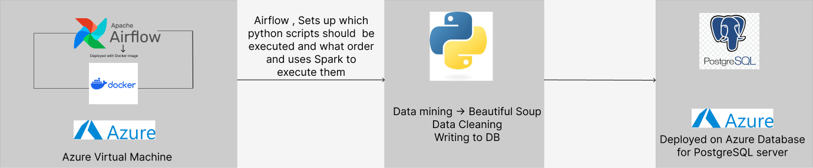
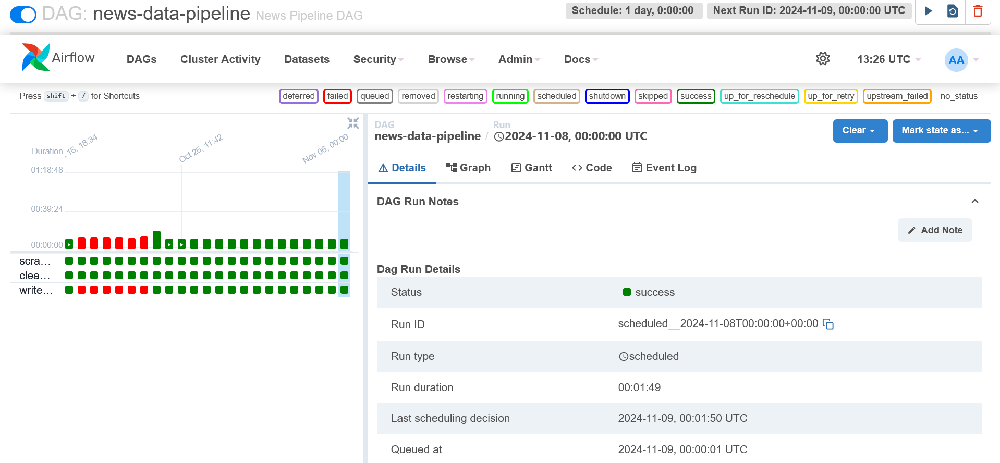

# news-data-pipeline

## Description
Objective of the project is to create a data pipeline which would run pyton scripts to mine data from various news outlets, clean them and store them in a Relational Database

## Tech Stack

- **Python**
	- For web scraping and data lineage
- **Apache Airflow**
	- For work flow management
	- Has the same  objective as Jenkins but a lot more better for handling Data pipelines
		- You can find a better comparison here: https://stackshare.io/stackups/airflow-vs-jenkins
- **Docker**
	- We use the docker image for airflow, its dependencies
- **Azure Virtual Machine**
	- Deploying docker image for the airflow scheduler
- **Azure Database for PostgreSQL servers**
	- Storage for the scraped data

## Infrastructure

### Data Ingest Pipeline

The above diagram shows the pattern on how the infrastructure is set up for the data pipeline to be ingested data into the DB
1. Apache Airflow manages the workflow and has the scheduler 
2. Airflow triggers the python scripts to scrape web data
	1. Data lineage is also scheduled by Airflow after the scraping is complete
3. Data is then stored inside the PostgreSQL DB in a properly formatted , labelled and annotated manner

## Workflow and logging
The pipeline runs on the Azure VM

- The scraper run produces logs which tell us the status of the scraping, number of total articles, scraped articles/total articles. 
Also the errors in scraping any of the attributes

- The cleaner has similar logs and displays the cleaned article message along with the article URL

The Database writer log also shows if an article is already present in the DB and if we had any issues writing to the DB